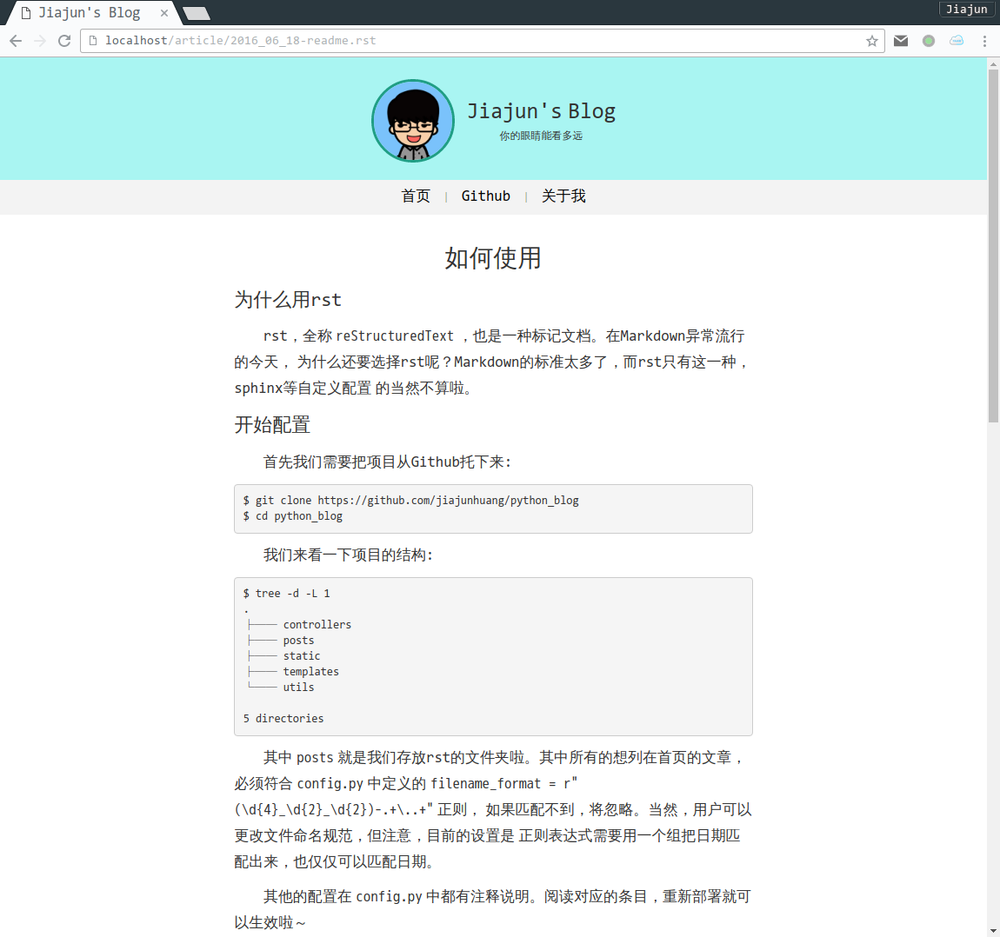

如何使用
==========

为什么用rst
-------------

rst，全称 ``reStructuredText`` ，也是一种标记文档。在Markdown异常流行的今天，
为什么还要选择rst呢？Markdown的标准太多了，而rst只有这一种，sphinx等自定义配置
的当然不算啦。

效果
------

开始配置
-----------

首先我们需要把项目从Github托下来::

    $ git clone https://github.com/jiajunhuang/python_blog
    $ cd python_blog

我们来看一下项目的结构::

    $ tree -d -L 1
    .
    ├── controllers
    ├── posts
    ├── static
    ├── templates
    └── utils

    5 directories

其中 ``posts`` 就是我们存放rst的文件夹啦。其中所有的想列在首页的文章，必须符合
``config.py`` 中定义的 ``filename_format = r"(\d{4}_\d{2}_\d{2})-.+\..+"`` 正则，
如果匹配不到，将忽略。当然，用户可以更改文件命名规范，但注意，目前的设置是
正则表达式需要用一个组把日期匹配出来，也仅仅可以匹配日期。

其他的配置在 ``config.py`` 中都有注释说明。阅读对应的条目，重新部署就可以生效啦～

部署
------

我们建议用一个Nginx挡在Tornado的前面，下面是我的Nginx配置::

    #user html;
    worker_processes  1;

    #error_log  logs/error.log;
    #error_log  logs/error.log  notice;
    #error_log  logs/error.log  info;

    #pid        logs/nginx.pid;

    events {
        worker_connections  1024;
    }

    http {
        include       mime.types;
        default_type  application/octet-stream;

        #log_format  main  '$remote_addr - $remote_user [$time_local] "$request" '
        #                  '$status $body_bytes_sent "$http_referer" '
        #                  '"$http_user_agent" "$http_x_forwarded_for"';

        #access_log  logs/access.log  main;

        sendfile        on;
        #tcp_nopush     on;

        #keepalive_timeout  0;
        keepalive_timeout  65;

        #gzip  on;

        server {
            listen       80;
            server_name  _;

            #charset koi8-r;

            #access_log  logs/host.access.log  main;

            location / {
                proxy_pass http://localhost:8080;
            }

            #error_page  404              /404.html;

            # redirect server error pages to the static page /50x.html
            #
            error_page   500 502 503 504  /50x.html;
            location = /50x.html {
                root   /usr/share/nginx/html;
            }
        }
    }

原理
-----

原理其实很简单，就是在启动的时候，Tornado读取 ``config.py`` 中指定的目录下的所有文件，
并且解析文件名，然后生成一个文件目录的列表，并且缓存在类中（因为Config类是单例）。

另外配置了Tornado的autoreload项为True，并且添加了对posts目录的监听，所以只要该目录
有改动，进程就会自动重启。

收获
-----

这次写这个小项目的主要收获是前端方面的收获，更加熟悉了CSS布局等。
